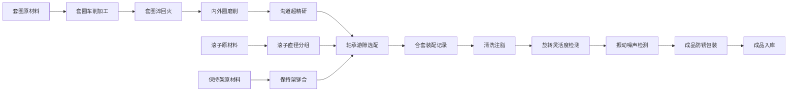

## 1. 产品概述
滚动轴承制造执行系统（MES），用于轴承制造厂全流程管理套圈、滚子和轴承装配。系统覆盖从原材料到成品的完整生产链条，解决生产过程追溯、质量控制、工序协同等核心问题，服务于生产管理人员、车间操作员和质量检验员。

产品目标：实现轴承制造全流程数字化管理，提升生产效率30%，降低次品率15%，实现全流程质量可追溯。

## 2. 核心功能

### 2.1 用户角色
| 角色 | 注册方式 | 核心权限 |
|------|----------|----------|
| 系统管理员 | 后台创建 | 用户管理、系统配置、数据统计 |
| 生产主管 | 后台创建 | 生产计划、工序调度、报表查看 |
| 车间操作员 | 后台创建 | 工序录入、数据提交、任务查看 |
| 质量检验员 | 后台创建 | 质量检测、数据录入、质检报告 |

### 2.2 功能模块
1. **套圈车削模块**：套圈车削加工记录、工序流转
2. **热处理模块**：套圈淬回火、温度监控、硬度检测
3. **磨加工模块**：内外圈磨削、沟道超精研、尺寸检测
4. **滚子配套模块**：滚子直径分组、配套管理
5. **保持架模块**：保持架铆合、尺寸检测
6. **轴承装配模块**：轴承游隙选配、合套装配记录、清洗注脂
7. **振动检测模块**：旋转灵活度、振动噪声检测、成品防锈包装

### 2.3 页面详情
| 页面名称 | 模块名称 | 功能描述 |
|----------|----------|----------|
| 首页仪表盘 | 数据概览 | 生产进度统计、质量趋势图表、待办任务提醒、实时产量看板 |
| 套圈车削 | 套圈车削模块 | 车削加工记录、设备状态、工艺参数、批次流转 |
| 热处理 | 热处理模块 | 淬回火记录、温度曲线、硬度检测报告、批次管理 |
| 磨加工 | 磨加工模块 | 内外圈磨削记录、沟道超精研数据、尺寸公差检测 |
| 滚子配套 | 滚子配套模块 | 滚子直径分组、分组统计、配套方案管理 |
| 保持架 | 保持架模块 | 铆合记录、保持架检测、库存管理 |
| 轴承装配 | 轴承装配模块 | 游隙选配计算、合套装配记录、清洗注脂工序 |
| 振动检测 | 振动检测模块 | 旋转灵活度检测、振动噪声分析、成品包装记录 |
| 数据查询 | 全流程追溯 | 批次追溯、工序查询、质量报告导出 |
| 系统管理 | 用户管理 | 用户权限、角色配置、系统设置 |

## 3. 核心流程
轴承生产从套圈原材料开始，经过车削、热处理、磨加工三道主要工序，同时滚子经过直径分组，保持架完成铆合检测，最后在装配车间完成游隙选配、合套装配、清洗注脂，经振动检测合格后进行防锈包装入库。

## 4. 用户界面设计

### 4.1 设计风格
- **主色调**：工业蓝 #165DFF（专业、可靠），辅以深灰 #1D2129（稳重）
- **强调色**：橙色 #FF7D00（警示、重要状态），绿色 #00B42A（合格、正常），红色 #F53F3F（不合格、异常）
- **按钮风格**：矩形微圆角（4px），悬停有微妙阴影，点击有按压效果
- **字体**：标题使用 Noto Sans SC Bold，正文使用 Noto Sans SC Regular，数据表格使用等宽字体 JetBrains Mono
- **布局风格**：左侧导航栏 + 顶部状态栏 + 主体内容区，采用卡片式布局，数据表格为主
- **图标风格**：线性图标，统一使用 Lucide React 图标库，工业风格

### 4.2 页面设计概览
| 页面名称 | 模块名称 | UI元素 |
|----------|----------|--------|
| 首页仪表盘 | 数据概览 | 数据卡片网格、折线图（产量趋势）、柱状图（质量统计）、饼图（工序占比）、待办任务列表、实时状态指示灯 |
| 工序页面 | 各生产模块 | 顶部筛选栏 + 数据表格 + 新增/编辑弹窗 + 详情侧边栏 + 状态标签 |
| 数据查询 | 全流程追溯 | 搜索框 + 时间筛选 + 批次树形追溯图 + 工序时间轴 |
| 系统管理 | 用户管理 | 用户列表表格、角色配置弹窗、权限矩阵 |

### 4.3 响应式
采用桌面优先设计，适配 1920×1080 及以上分辨率。当屏幕宽度小于 1280px 时，侧边栏可折叠收起，表格支持横向滚动。移动端保持核心功能可用，重点优化表格和表单的触摸交互。

### 4.4 交互细节
- 页面加载：顶部进度条动画 + 内容渐入
- 表格行：悬停高亮，选中行有左侧色条标识
- 状态标签：脉冲动画提示异常状态
- 表单提交：按钮加载状态 + 成功/失败Toast提示
- 数据变更：表格行高亮闪烁提示新数据
