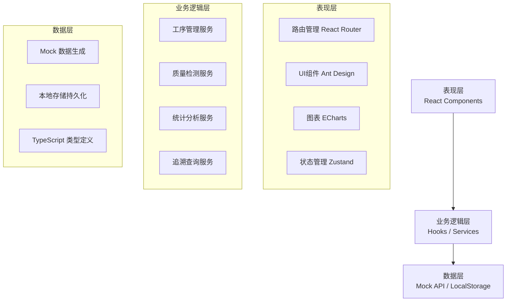

## 1. 架构设计

本系统采用前端单页应用（SPA）架构，数据层使用Mock数据模拟后端接口，便于演示和开发。整体架构分为三层：表现层、业务逻辑层、数据层。



## 2. 技术栈描述

- **前端框架**：React@18.2.0 + TypeScript@5.4.0
- **构建工具**：Vite@5.2.0
- **CSS框架**：TailwindCSS@3.4.0
- **UI组件库**：Ant Design@5.16.0
- **路由管理**：React Router DOM@6.22.0
- **状态管理**：Zustand@4.5.0
- **图表库**：ECharts@5.5.0
- **图标库**：Lucide React@0.363.0
- **日期处理**：Day.js@1.11.0
- **数据持久化**：LocalStorage
- **后端服务**：无（使用Mock数据）
- **数据库**：无（使用LocalStorage + 内存数据）

## 3. 路由定义

| 路由路径 | 页面名称 | 模块 |
|---------|---------|------|
| /dashboard | 首页仪表盘 | 数据概览 |
| /turning | 套圈车削 | 套圈车削模块 |
| /heat-treatment | 热处理 | 热处理模块 |
| /grinding | 磨加工 | 磨加工模块 |
| /roller | 滚子配套 | 滚子配套模块 |
| /cage | 保持架 | 保持架模块 |
| /assembly | 轴承装配 | 轴承装配模块 |
| /vibration | 振动检测 | 振动检测模块 |
| /trace | 数据查询 | 全流程追溯 |
| /system/users | 用户管理 | 系统管理 |
| /system/roles | 角色配置 | 系统管理 |
| * | 404页面 | - |

## 4. 数据模型

### 4.1 数据模型定义

```mermaid
erDiagram
    BEARING_TYPE ||--o{ RING : "包含"
    BEARING_TYPE ||--o{ ROLLER : "包含"
    BEARING_TYPE ||--o{ CAGE : "包含"
    
    RING ||--o{ TURNING_PROCESS : "经过"
    TURNING_PROCESS ||--o{ HEAT_PROCESS : "流转到"
    HEAT_PROCESS ||--o{ GRINDING_PROCESS : "流转到"
    
    ROLLER ||--o{ ROLLER_GROUP : "分组到"
    
    CAGE ||--o{ CAGE_RIVET : "经过"
    
    GRINDING_PROCESS ||--o{ ASSEMBLY : "用于"
    ROLLER_GROUP ||--o{ ASSEMBLY : "用于"
    CAGE_RIVET ||--o{ ASSEMBLY : "用于"
    
    ASSEMBLY ||--o{ VIBRATION_TEST : "检测"
    VIBRATION_TEST ||--o{ FINISHED_PRODUCT : "包装"

    BEARING_TYPE {
        string id PK
        string name
        string model
        float inner_diameter
        float outer_diameter
        float width
    }
    
    RING {
        string id PK
        string batch_no
        string bearing_type_id FK
        string type "内圈/外圈"
        string material
        int quantity
        date production_date
    }
    
    TURNING_PROCESS {
        string id PK
        string ring_id FK
        string machine_no
        string operator
        datetime start_time
        datetime end_time
        float outer_diameter
        float inner_diameter
        float width
        string status
        string remark
    }
    
    HEAT_PROCESS {
        string id PK
        string turning_id FK
        string furnace_no
        string operator
        datetime quenching_time
        float quenching_temp
        datetime tempering_time
        float tempering_temp
        float hardness
        string status
    }
    
    GRINDING_PROCESS {
        string id PK
        string heat_id FK
        string machine_no
        string operator
        datetime process_time
        float outer_diameter
        float inner_diameter
        float groove_roughness
        string status
    }
    
    ROLLER {
        string id PK
        string batch_no
        string bearing_type_id FK
        string material
        int quantity
        float diameter
        float length
    }
    
    ROLLER_GROUP {
        string id PK
        string roller_id FK
        string group_no
        float diameter_min
        float diameter_max
        int quantity
        string operator
        date group_date
    }
    
    CAGE {
        string id PK
        string batch_no
        string bearing_type_id FK
        string material
        int quantity
    }
    
    CAGE_RIVET {
        string id PK
        string cage_id FK
        string machine_no
        string operator
        datetime process_time
        float pocket_diameter
        float pocket_distance
        string status
    }
    
    ASSEMBLY {
        string id PK
        string assembly_batch
        string bearing_type_id FK
        string inner_ring_id FK
        string outer_ring_id FK
        string roller_group_id FK
        string cage_id FK
        float radial_clearance
        string operator
        datetime assembly_time
        int quantity
        string status
    }
    
    VIBRATION_TEST {
        string id PK
        string assembly_id FK
        string tester
        datetime test_time
        float rotation_speed
        float vibration_value
        float noise_db
        boolean rotation_smooth
        string status
    }
    
    FINISHED_PRODUCT {
        string id PK
        string vibration_id FK
        string package_batch
        string packager
        datetime package_date
        int quantity
        string rust_proof
        string storage_location
    }
    
    SYS_USER {
        string id PK
        string username
        string real_name
        string role_id FK
        string status
    }
    
    SYS_ROLE {
        string id PK
        string role_name
        string permissions
    }
```



### 4.2 核心类型定义

```typescript
// 基础状态枚举
type ProcessStatus = 'pending' | 'processing' | 'completed' | 'qualified' | 'unqualified';

// 套圈基础信息
interface Ring {
  id: string;
  batchNo: string;
  bearingTypeId: string;
  bearingTypeName: string;
  type: 'inner' | 'outer';
  material: string;
  quantity: number;
  productionDate: string;
}

// 车削加工记录
interface TurningProcess {
  id: string;
  ringId: string;
  ringBatchNo: string;
  ringType: 'inner' | 'outer';
  machineNo: string;
  operator: string;
  startTime: string;
  endTime: string;
  outerDiameter: number;
  innerDiameter: number;
  width: number;
  status: ProcessStatus;
  remark: string;
}

// 热处理记录
interface HeatProcess {
  id: string;
  turningId: string;
  ringBatchNo: string;
  furnaceNo: string;
  operator: string;
  quenchingTime: string;
  quenchingTemp: number;
  temperingTime: string;
  temperingTemp: number;
  hardness: number;
  status: ProcessStatus;
}

// 磨加工记录
interface GrindingProcess {
  id: string;
  heatId: string;
  ringBatchNo: string;
  ringType: 'inner' | 'outer';
  machineNo: string;
  operator: string;
  processTime: string;
  outerDiameter: number;
  innerDiameter: number;
  grooveRoughness: number;
  status: ProcessStatus;
}

// 滚子直径分组
interface RollerGroup {
  id: string;
  rollerBatchNo: string;
  bearingTypeName: string;
  groupNo: string;
  diameterMin: number;
  diameterMax: number;
  quantity: number;
  operator: string;
  groupDate: string;
}

// 保持架铆合
interface CageRivet {
  id: string;
  cageBatchNo: string;
  bearingTypeName: string;
  machineNo: string;
  operator: string;
  processTime: string;
  pocketDiameter: number;
  pocketDistance: number;
  status: ProcessStatus;
}

// 轴承装配
interface BearingAssembly {
  id: string;
  assemblyBatch: string;
  bearingTypeName: string;
  bearingModel: string;
  innerRingBatch: string;
  outerRingBatch: string;
  rollerGroupNo: string;
  cageBatch: string;
  radialClearance: number;
  operator: string;
  assemblyTime: string;
  quantity: number;
  status: ProcessStatus;
}

// 振动检测
interface VibrationTest {
  id: string;
  assemblyId: string;
  assemblyBatch: string;
  bearingTypeName: string;
  tester: string;
  testTime: string;
  rotationSpeed: number;
  vibrationValue: number;
  noiseDb: number;
  rotationSmooth: boolean;
  status: ProcessStatus;
}

// 成品包装
interface FinishedProduct {
  id: string;
  packageBatch: string;
  bearingTypeName: string;
  bearingModel: string;
  quantity: number;
  packager: string;
  packageDate: string;
  rustProof: string;
  storageLocation: string;
}

// 系统用户
interface SysUser {
  id: string;
  username: string;
  realName: string;
  roleId: string;
  roleName: string;
  status: 'active' | 'inactive';
}

// 统计数据
interface DashboardStats {
  todayProduction: number;
  qualifiedRate: number;
  pendingTasks: number;
  processingBatches: number;
  productionTrend: { date: string; output: number }[];
  qualityTrend: { date: string; rate: number }[];
  moduleStats: { name: string; count: number }[];
  recentTasks: any[];
}
```

## 5. 目录结构

```
src/
├── assets/              # 静态资源
│   ├── images/
│   └── styles/
├── components/          # 公共组件
│   ├── Layout/          # 布局组件
│   ├── DataTable/       # 数据表格组件
│   ├── StatusTag/       # 状态标签组件
│   ├── ProcessTimeline/ # 工序时间轴
│   └── charts/          # 图表组件
├── pages/               # 页面组件
│   ├── Dashboard/       # 首页仪表盘
│   ├── Turning/         # 套圈车削
│   ├── HeatTreatment/   # 热处理
│   ├── Grinding/        # 磨加工
│   ├── Roller/          # 滚子配套
│   ├── Cage/            # 保持架
│   ├── Assembly/        # 轴承装配
│   ├── Vibration/       # 振动检测
│   ├── Trace/           # 数据查询
│   └── System/          # 系统管理
├── store/               # 状态管理
│   ├── useProcessStore.ts
│   └── useUserStore.ts
├── services/            # 业务服务
│   ├── processService.ts
│   ├── statsService.ts
│   └── mockApi.ts
├── types/               # TypeScript类型定义
│   └── index.ts
├── utils/               # 工具函数
│   ├── date.ts
│   ├── format.ts
│   └── mock.ts
├── router/              # 路由配置
│   └── index.tsx
├── App.tsx
├── main.tsx
└── vite-env.d.ts
```
